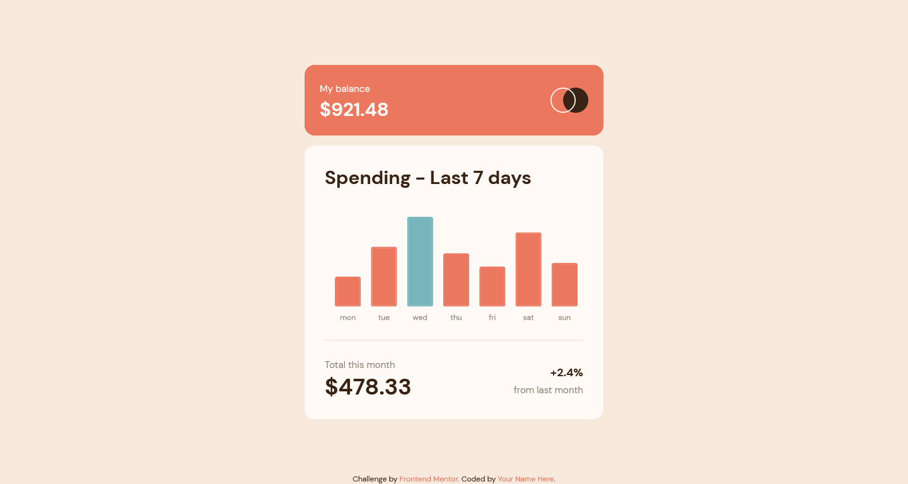
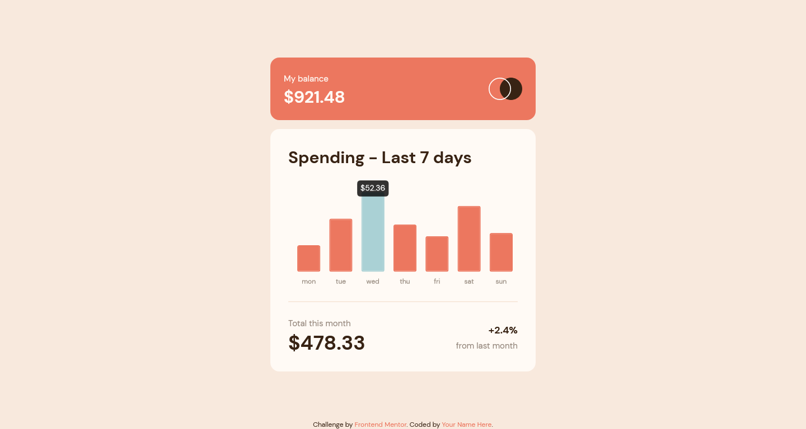
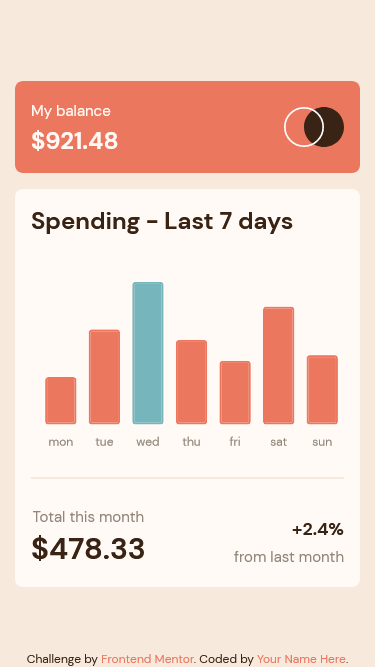
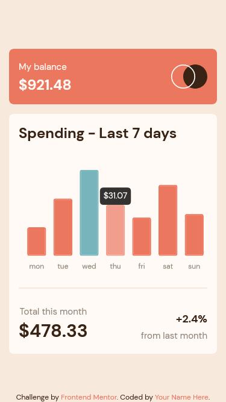

# Frontend Mentor - Expenses chart component solution

This is a solution to the [Expenses chart component challenge on Frontend Mentor](https://www.frontendmentor.io/challenges/expenses-chart-component-e7yJBUdjwt). Frontend Mentor challenges help you improve your coding skills by building realistic projects. 

## Table of contents

- [Overview](#overview)
  - [The challenge](#the-challenge)
  - [Screenshot](#screenshot)
  - [Links](#links)
- [My process](#my-process)
  - [Built with](#built-with)
  - [What I learned](#what-i-learned)
  - [Continued development](#continued-development)
- [Author](#author)

## Overview

### The challenge

Users should be able to:

- View the bar chart and hover over the individual bars to see the correct amounts for each day
- See the current day’s bar highlighted in a different colour to the other bars
- View the optimal layout for the content depending on their device’s screen size
- See hover states for all interactive elements on the page
- **Bonus**: Use the JSON data file provided to dynamically size the bars on the chart

### Screenshot

#### Desktop normal view

#### Desktop active view

#### Mobile normal view

#### Mobile active view

### Links

- Live Site URL: [Click here](https://expenses-chart-component-yaikarace.vercel.app)

## My process

### Built with

- Semantic HTML5 markup
- CSS custom properties
- Flexbox
- CSS Grid
- Mobile-first workflow
- [Vue.js](https://vuejs.org/) - JS Framework
- [Tailwind CSS](https://tailwindcss.com) - CSS Framework
- [Vue Chartkick](https://chartkick.com/vue) - JS Library
- [Chart.js](https://www.chartjs.org/) - JS Library
### What I learned
I learned how to use libraries together with Vue.js and I learned how to make charts and customize them with the Vue Chartkick library in conjunction with the Chart.js library, I also learned how to get the data from a JSON file. 

### Continued development
I will continue to learn more about how to create components and best practices in Vue.js and I will continue to learn how to use JavaScript libraries to further improve my coding and productivity.

## Author

- Frontend Mentor - [@YaikaRace](https://www.frontendmentor.io/profile/yourusername)
- GitHub [YaikaRace](https://github.com/yaikarace)
- YouTube Channel [Yaika Race](https://youtube.com/c/yaikarace)